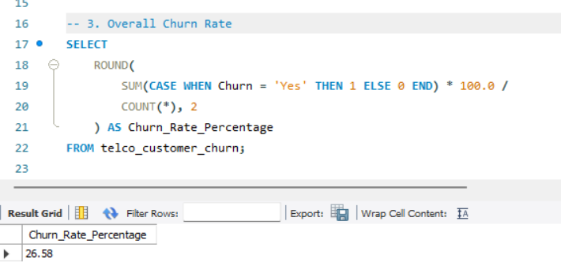
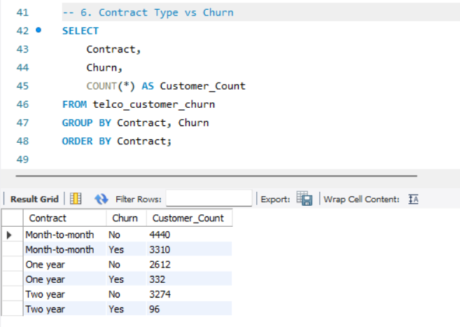
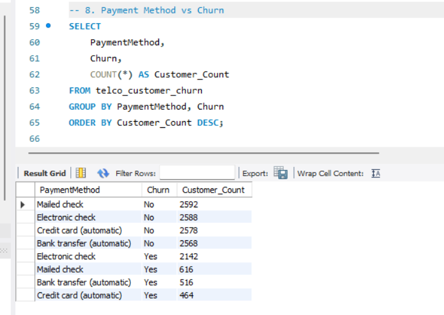
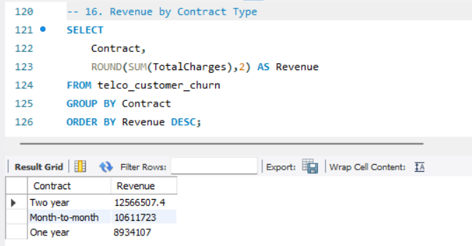
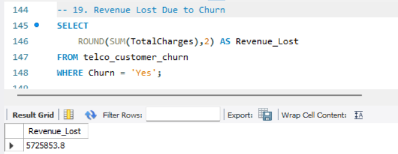

# Telco Customer Churn Analysis using SQL

## Project Overview

This project analyzes customer churn patterns in a telecom company using SQL. The objective is to identify factors influencing customer attrition, understand customer behavior, evaluate service adoption, and uncover revenue-related insights to support customer retention strategies.

---

## Business Problem

Customer churn directly impacts business revenue and profitability. Understanding why customers leave is essential for improving retention and customer satisfaction.

This project uses SQL to analyze customer demographics, contract types, payment methods, services, and revenue metrics to identify churn drivers and support data-driven decision-making.

---

## Project Objectives

- Analyze overall customer churn.
- Identify high-risk customer segments.
- Evaluate the impact of contract types on churn.
- Understand service-related churn patterns.
- Analyze payment behavior and customer retention.
- Assess revenue impact due to customer churn.
- Generate actionable business recommendations.

---

## Dataset Information

**Dataset:** Telco Customer Churn Dataset

**Total Records:** 7,043 Customers

### Dataset Features

- Customer Demographics
- Contract Information
- Internet Services
- Payment Methods
- Monthly Charges
- Total Charges
- Customer Churn Status

---

## Tools Used

- MySQL
- SQL

---

## SQL Concepts Used

- SELECT
- WHERE
- GROUP BY
- ORDER BY
- COUNT()
- SUM()
- AVG()
- CASE WHEN
- Aggregate Functions

---

## Business Questions Solved

1. What is the overall churn rate?
2. How many customers churned versus remained active?
3. Which contract type has the highest churn?
4. How does internet service affect churn?
5. Which payment method shows the highest churn?
6. What is the impact of Tech Support on customer retention?
7. How does customer tenure relate to churn?
8. What is the average monthly charge by churn status?
9. How much revenue has been lost due to churn?
10. Which customer segments represent the highest churn risk?

---

## Key SQL Analysis

### Customer Analysis

- Churn Distribution
- Gender vs Churn
- Senior Citizen vs Churn
- Partner vs Churn
- Dependents vs Churn

### Contract Analysis

- Contract Type vs Churn
- Revenue by Contract Type

### Service Analysis

- Internet Service vs Churn
- Tech Support vs Churn
- Online Security vs Churn

### Billing Analysis

- Payment Method vs Churn
- Average Monthly Charges Analysis

### Revenue Analysis

- Revenue by Contract Type
- Revenue by Payment Method
- Revenue Lost Due to Churn
- High-Risk Customer Identification

---

## Query Output Screenshots

### Overall Churn Rate



### Contract Type vs Churn



### Payment Method vs Churn



### Revenue by Contract Type



### Revenue Lost Due to Churn



---

## Key Business Insights

### Customer Churn

- Approximately 26.54% of customers have churned.
- More than one-fourth of customers are no longer retained.

### Contract Analysis

- Month-to-Month customers have the highest churn rate.
- Two-Year contracts show the strongest customer retention.

### Service Analysis

- Customers without Tech Support are significantly more likely to churn.
- Online Security services positively influence customer retention.

### Payment Analysis

- Electronic Check customers exhibit higher churn behavior.
- Customers using automatic payment methods show better retention.

### Revenue Analysis

- Long-tenure customers contribute substantially more revenue.
- Revenue loss is heavily concentrated among churned customers.
- Contract type has a strong impact on customer lifetime value.

---

## Business Recommendations

1. Encourage customers to switch to long-term contracts.
2. Promote Tech Support and Online Security services.
3. Improve onboarding and engagement for new customers.
4. Reduce churn among Electronic Check users through targeted campaigns.
5. Implement proactive retention strategies for high-risk customers.

---

## Project Structure

```text
Telco-Customer-Churn-SQL-Analysis
│
├── README.md
├── Business Requirements Document.md
├── Telco_Customer_Churn_Analysis.sql
├── telco_customer_churn_data.csv
└── Images
    ├── overall_churn_rate.png
    ├── contract_vs_churn.png
    ├── payment_method_vs_churn.png
    ├── revenue_by_contract.png
    └── revenue_lost_due_to_churn.png
```

---

## Conclusion

This SQL project provides valuable insights into customer churn behavior, service adoption, payment preferences, and revenue impact. The findings can help telecom companies improve customer retention, reduce churn, and increase long-term profitability.

---

## Author

**Bhuvaneswari**

Data Analytics Portfolio Project
